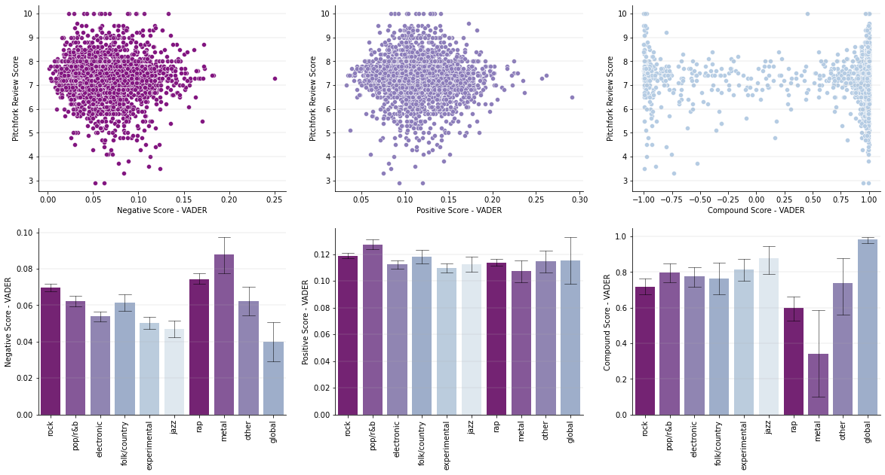
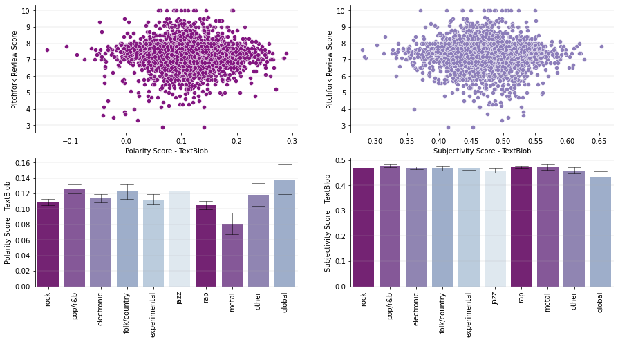
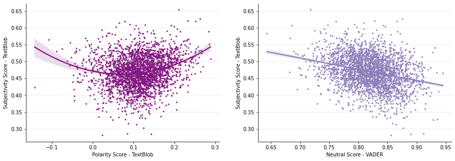
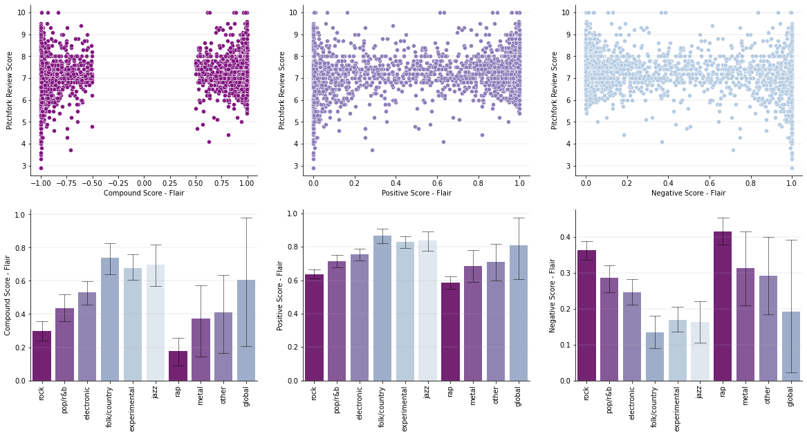

# pitchfork_NLP

### Introduction: 

[Pitchfork](https://pitchfork.com/) is an American online music publication that regularly posts reviews and ratings (0-10) of recently released / reissued albums. After gaining immense readership since its launch in 1995, [it has been suggested](https://www.washingtonpost.com/wp-dyn/content/article/2006/04/28/AR2006042800457.html) that the positive or negative quality of Pitchfork's reviews can have a significant influence on an album's popularity. In fact, Pitchfork has been [accused](https://slate.com/culture/2006/11/the-indie-music-site-that-everyone-loves-to-hate.html) of deliberately writing provocative and contrarian reviews in order to attract attention--it has been criticized for its airs of cynicism and elitism as well. All the while, the publication has had the reputation that its reviews are unpredicatable and very dependent on which of its reviewers/contributors writes the review. 

The combination of pithy, provocative language, seemingly unpredictable reviews, numerical ratings, and a large impact on the success, or lack thereof, of up-and-coming artists, renders Pitchfork's reviews an interesting area to which to apply NLP and ML techniques.

This project attempts to explore the sentiment of Pitchfork reviews, and how, if at all, it relates to the actual rating of an album (0-10) and how it may vary across other attributes, such as genre. This project also attempts to utilize sentiment analysis in a regression context, as a predictor of the ultimate rating of the album itself.

### Findings: Exploratory Data & Sentiment Analysis

**Exploratory Data Analysis**<br>*(exploratory_sentiment_analysis.ipynb)*

* While the Pitchfork Review Scores appear to be normally distributed around ~7.5 with little variance, there is greater variance in scores within genres.
* However, Rock, Experimental, Folk/Country, Electronic and Jazz appear to have greater median scores, while Rap appears to have a lower median score.


**Sentiment Analysis: NLTK - VADER (Valence Aware Dictionary and sEntiment Reasoner)**<br>*(exploratory_sentiment_analysis.ipynb)*

*This package relies on a rules-based sentiment analyzer, attaching a positive or negative rating to specific words and will consider negation. The shortcoming of this package is that as text gets longer (i.e. a full album review), more neutral words are present and the overall score becomes neutralized. Additionally, because it is rules-based (rather than a pre-trained model), sarcasm, jargon or figures of speech are misinterpreted.*

*The package returns a negative (neg), neutral (neu), positive (pos), and compound (comp) score.*

* **neg** + **neu** + **pos** = 1
* **comp**: value between -1 and +1

*Observations:*

* There does not appear to be a strong relationship between VADER scores and Pitchfork Review Score. The lowest Pitchfork Review Scores have very high Compound VADER Scores, which might indicate that the VADER score is not picking up on context / figures of speech / irony in the worst-rated reviews.
* It appears as if Experimental, Electronic and Jazz albums have lower Negative VADER Scores, which is consistent with them having greater Pitchfork Review Scores.
* It appears as if Experimental and Jazz albums have greater Compound VADER Scores, which is consistent with them having greater Pitchfork Review Scores.
* It appears as if Rap albums have lower Compound VADER Scores, which is consistent with them having lower Pitchfork Review Scores.
* Metal albums appear to have greater Negative VADER Scores, as well as lower Compound VADER Scores; however, it did not appear that they have lower Pitchfork Review Scores. This could potentially be due to genre-specific language used in these album reviews that the NLTK-VADER cannot pick up on.



**Sentiment Analysis: TextBlob - Polarity & Subjectivity**<br>*(exploratory_sentiment_analysis.ipynb)*

*This package also relies on a rules-based sentiment analyzer and has the same shortcomings as the package from NLTK. However, this package also offers a score related to the subjectivity of a text.*

*The package returns a polarity and subjectivity score.*

* **polarity**: value between -1 and +1
* **subjectivity**: value between 0 and 1

*Observations:*

* There does not appear to be a strong relationship between Polarity/Subjectivity scores and Pitchfork Review Score. However, the lowest Pitchfork Review Scores are not associated with the highest Polarity scores, unlike the Compound VADER scores.
* It appears as if Folk/Country and Jazz albums have greater Polarity Scores, which is consistent with them having greater Pitchfork Review Scores.
* It appears as if Rap albums have lower Polarity Scores, which is consistent with them having lower Pitchfork Review Scores.
* Metal albums appear to have lower Polarity Scores, however it does not appear that they have lower Pitchfork Review Scores. This could potentially be due to genre-specific language used in these album reviews that TextBlob cannot pick up on, similarly to NLTK.
* There does not appear to be meaningful difference in Subjectivity Score across genres.



* There appears to be some quadratic association between Sentivity and Polarity scores. As a review takes on a more positive or negative Polarity Score, its Subjectivity Score also seems to increase. That is, opinionated language appears to be associated with polarizing language.
* This relatinoship is visually corroborated by looking as how Subjectivity Score trends with Neutral VADER Score. As an article is more neutral, it is also less subjective



**Flair - Pre-trained Embedding-based Model**<br>*(exploratory_sentiment_analysis.ipynb)*

*Flair is a pre-trained embedding-based model--each word is represented within a vector space. This can take into account textual context, unlike rules-based approaches. The shortcoming of this model is that it is much slower to implement.*

*The package returns a label, **POSITIVE** or **NEGATIVE**, along with a confidence score between 0 and 1. We convert this confidence score into a composite score (between -1 and +1), and a positive and negative score (each between 0 and 1).*

*Observations:*

* The Compound Flair Score seems to be very deterministic, more often returning values < -0.5 or > +0.5. Compared to the other two approaches, the Flair Score seems to find far less neutral language.
* The Flair Score successfully gives lower scores to the lowest rated albums, as compared to NLTK. This may be explained by the pre-trained model that can better understand context, as words are considered within a vector space.
* It appears as if Experimental, Folk/Country and Jazz albums have greater Compound Flair Scores, greater Positive Flair Scores, and lower Negative Flair Scores, which is all consistent with them having greater Pitchfork Review Scores.
* It appears as if Rock albums have lower Compound Flair Scores, lower Positive Flair Scores, and greater Negative Flair Scores, which is all inconsistent with them having greater Pitchfork Review Scores.
* It appears as if Rap albums have lower Compound Flair Scores, lower Positive Flair Scores, and greater Negative Flair Scores, which is all consistent with them having greater Pitchfork Review Scores.



### Findings: Regression

The goal of this regression analysis to generate a high-performing prediction. As each sentiment analysis package had advantages and disadvantages, and some found "plausible" relationships between reviews and ratings, with respect to genres, while others did not (or found "implausible" relationships), we will train and tune the hyperparameters of regressors that are more apt to handle large sets of features and the relationships between them. Namely,

* Rand

*Please find an outline of the working directory below:*

``` bash
├── data
│   ├── reviews.csv                         # raw data from Pitchfork (including full reviews)
│   ├── reviews_sentiment.csv               # review sentiment scores from exploratory data and sentiment analysis  
├── scraper.py                              # script leveraging BeautifulSoup and Selenium WebDriver to scrape the reviews 
├── exploratory_sentiment_analysis.ipynb    # EDA and sentiment analysis 
├── sentiment_in_regression.ipynb           # sentiment scores in a regression context to predict ratings
```
