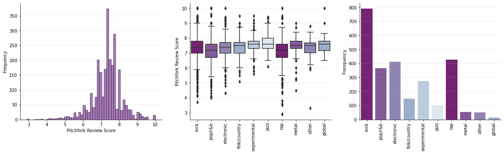

# pitchfork_NLP

### Introduction: 

[Pitchfork](https://pitchfork.com/) is an American online music publication that regularly posts reviews and ratings (0-10) of recently released / reissued albums. After gaining immense readership since its launch in 1995, [it has been suggested](https://www.washingtonpost.com/wp-dyn/content/article/2006/04/28/AR2006042800457.html) that the positive or negative quality of Pitchfork's reviews can have a significant influence on an album's popularity. In fact, Pitchfork has been [accused](https://slate.com/culture/2006/11/the-indie-music-site-that-everyone-loves-to-hate.html) of deliberately writing provocative and contrarian reviews in order to attract attention--it has been criticized for its airs of cynicism and elitism as well. All the while, the publication has had the reputation that its reviews are unpredicatable and very dependent on which of its reviewers/contributors writes the review. 

The combination of pithy, provocative language, seemingly unpredictable reviews, numerical ratings, and a large impact on the success, or lack thereof, of up-and-coming artists, renders Pitchfork's reviews an interesting area to which to apply NLP and ML techniques.

This project attempts to explore the sentiment of Pitchfork reviews, and how, if at all, it relates to the actual rating of an album (0-10) and how it may vary across other attributes, such as genre. This project also attempts to utilize sentiment analysis in a regression context, as a predictor of the ultimate rating of the album itself.

### Findings: 

**Exploratory Data Analysis**<br>*(exploratory_sentiment_analysis.ipynb)*

* While the Pitchfork Review Scores appear to be normally distributed around ~7.5 with little variance, there is greater variance in scores within genres.
* However, Rock, Experimental, Folk/Country and Jazz appear to have greater median scores, while Rap appears to have a lower median score.



*Please find an outline of the working directory below:*

``` bash
├── data
│   ├── reviews.csv                         # raw data from Pitchfork (including full reviews)
│   ├── reviews_sentiment.csv               # review sentiment scores from exploratory data and sentiment analysis  
├── scraper.py                              # script leveraging BeautifulSoup and Selenium WebDriver to scrape the reviews 
├── exploratory_sentiment_analysis.ipynb    # EDA and sentiment analysis 
├── sentiment_in_regression.ipynb           # sentiment scores in a regression context to predict ratings
```
